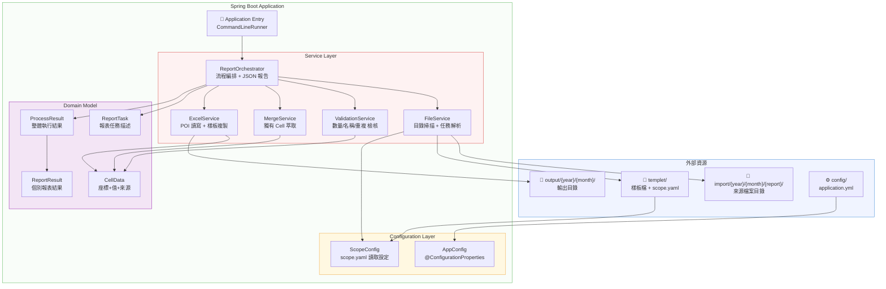
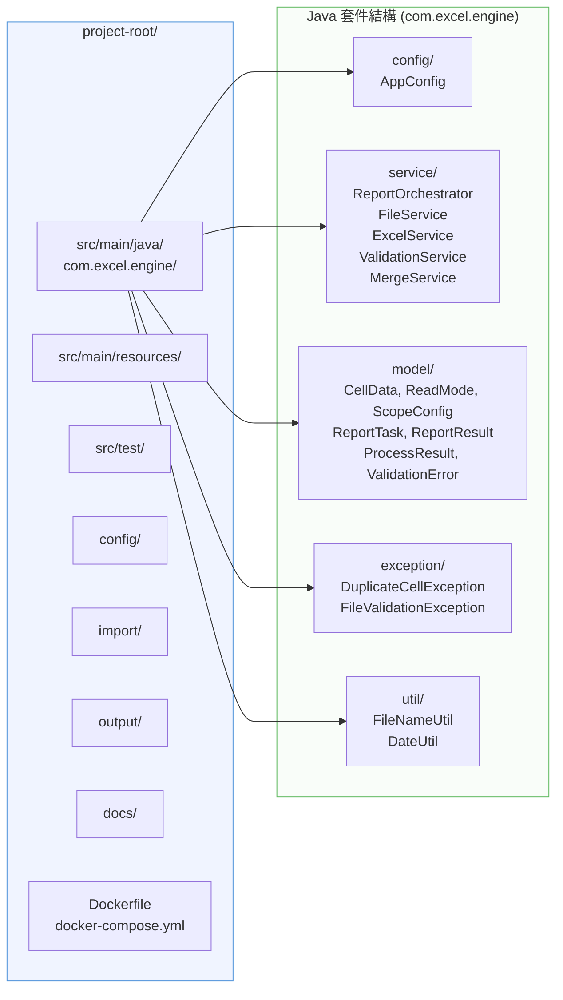
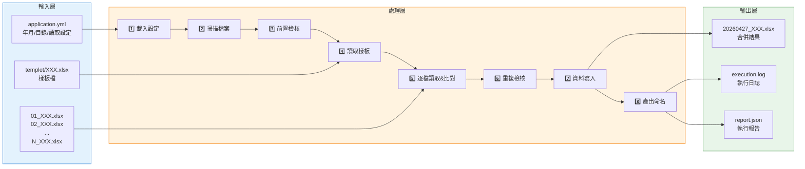
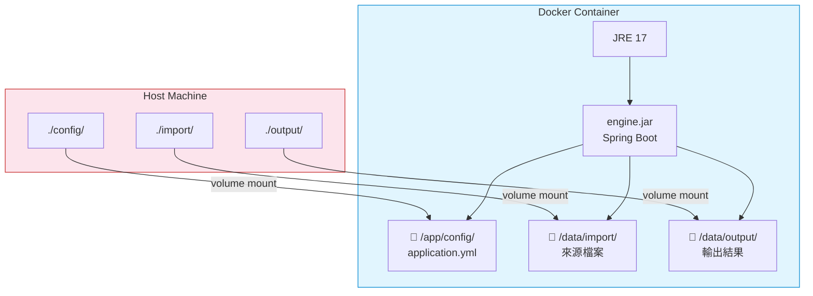
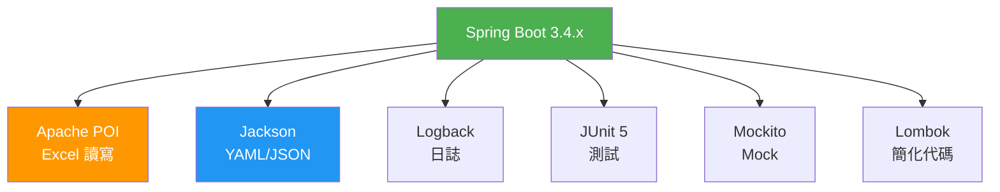

# 系統架構圖

> 專案：Excel Report Integration Engine  
> 版本：v1.0 (已實作)  

---

## 一、系統整體架構

```mermaid
graph TB
    subgraph External["外部資源"]
        FS_IN["📂 import/{year}/{month}/{report}/<br/>來源檔案目錄"]
        FS_TPL["📄 templet/<br/>樣板檔 + scope.yaml"]
        FS_OUT["📂 output/{year}/{month}/<br/>輸出目錄"]
        CONFIG["⚙️ config/<br/>application.yml"]
    end

    subgraph App["Spring Boot Application"]
        direction TB
        MAIN["🚀 Application Entry<br/>CommandLineRunner"]

        subgraph Config_Layer["Configuration Layer"]
            APP_CFG["AppConfig<br/>@ConfigurationProperties"]
            SCOPE_CFG["ScopeConfig<br/>scope.yaml 讀取設定"]
        end

        subgraph Service_Layer["Service Layer"]
            ORCH["ReportOrchestrator<br/>流程編排 + JSON 報告"]
            FILE_SVC["FileService<br/>目錄掃描 + 任務解析"]
            EXCEL_SVC["ExcelService<br/>POI 讀寫 + 樣板複製"]
            VALID_SVC["ValidationService<br/>數量/名稱/重複 檢核"]
            MERGE_SVC["MergeService<br/>獨有 Cell 萃取"]
        end

        subgraph Domain["Domain Model"]
            CELL_DATA["CellData<br/>座標+值+來源"]
            REPORT["ReportTask<br/>報表任務描述"]
            RESULT["ProcessResult<br/>整體執行結果"]
            RPT_RESULT["ReportResult<br/>個別報表結果"]
        end
    end

    CONFIG --> APP_CFG
    FS_TPL --> SCOPE_CFG
    MAIN --> ORCH
    ORCH --> FILE_SVC
    ORCH --> VALID_SVC
    ORCH --> MERGE_SVC
    ORCH --> EXCEL_SVC
    FILE_SVC --> FS_IN
    FILE_SVC --> FS_TPL
    FILE_SVC --> SCOPE_CFG
    EXCEL_SVC --> CELL_DATA
    VALID_SVC --> CELL_DATA
    ORCH --> REPORT
    ORCH --> RESULT
    RESULT --> RPT_RESULT
    MERGE_SVC --> CELL_DATA
    EXCEL_SVC --> FS_OUT

    style External fill:#f0f4ff,stroke:#4a90d9
    style App fill:#f9fdf9,stroke:#5cb85c
    style Config_Layer fill:#fff8e1,stroke:#f0ad4e
    style Service_Layer fill:#fef2f2,stroke:#d9534f
    style Domain fill:#f3e5f5,stroke:#9c27b0
```

---

## 二、目錄結構架構

```mermaid
graph LR
    subgraph Project["project-root/"]
        direction TB
        SRC["src/main/java/<br/>com.excel.engine/"]
        RES["src/main/resources/"]
        TEST["src/test/"]
        CFG["config/"]
        IMP["import/"]
        OUT["output/"]
        DOCS["docs/"]
        DOCKER["Dockerfile<br/>docker-compose.yml"]
    end

    subgraph Source_Packages["Java 套件結構 (com.excel.engine)"]
        direction TB
        PKG_CFG["config/<br/>AppConfig"]
        PKG_SVC["service/<br/>ReportOrchestrator<br/>FileService<br/>ExcelService<br/>ValidationService<br/>MergeService"]
        PKG_MDL["model/<br/>CellData, ReadMode, ScopeConfig<br/>ReportTask, ReportResult<br/>ProcessResult, ValidationError"]
        PKG_EXC["exception/<br/>DuplicateCellException<br/>FileValidationException"]
        PKG_UTL["util/<br/>FileNameUtil<br/>DateUtil"]
    end

    SRC --> PKG_CFG
    SRC --> PKG_SVC
    SRC --> PKG_MDL
    SRC --> PKG_EXC
    SRC --> PKG_UTL

    style Project fill:#f0f4ff,stroke:#4a90d9
    style Source_Packages fill:#f9fdf9,stroke:#5cb85c
```

---

## 三、資料流架構

```mermaid
graph LR
    subgraph Input["輸入層"]
        YML["application.yml<br/>年月/目錄/讀取設定"]
        TPL["templet/XXX.xlsx<br/>樣板檔"]
        FILES["01_XXX.xlsx<br/>02_XXX.xlsx<br/>...<br/>N_XXX.xlsx"]
    end

    subgraph Process["處理層"]
        direction TB
        P1["1️⃣ 載入設定"]
        P2["2️⃣ 掃描檔案"]
        P3["3️⃣ 前置檢核"]
        P4["4️⃣ 讀取樣板"]
        P5["5️⃣ 逐檔讀取&比對"]
        P6["6️⃣ 重複檢核"]
        P7["7️⃣ 資料寫入"]
        P8["8️⃣ 產出命名"]
        P1 --> P2 --> P3 --> P4 --> P5 --> P6 --> P7 --> P8
    end

    subgraph Output["輸出層"]
        XLSX["20260427_XXX.xlsx<br/>合併結果"]
        LOG["execution.log<br/>執行日誌"]
        RPT["report.json<br/>執行報告"]
    end

    YML --> P1
    TPL --> P4
    FILES --> P5
    P7 --> XLSX
    P8 --> LOG
    P8 --> RPT

    style Input fill:#e3f2fd,stroke:#1976d2
    style Process fill:#fff3e0,stroke:#f57c00
    style Output fill:#e8f5e9,stroke:#388e3c
```

---

## 四、部署架構

```mermaid
graph TB
    subgraph Docker["Docker Container"]
        direction TB
        JRE["JRE 17"]
        JAR["engine.jar<br/>Spring Boot"]
        APP_CFG2["📂 /app/config/<br/>application.yml"]
        DATA_IN["📂 /data/import/<br/>來源檔案"]
        DATA_OUT["📂 /data/output/<br/>輸出結果"]
    end

    subgraph Host["Host Machine"]
        H_CFG["./config/"]
        H_IMP["./import/"]
        H_OUT["./output/"]
    end

    H_CFG -->|"volume mount"| APP_CFG2
    H_IMP -->|"volume mount"| DATA_IN
    H_OUT -->|"volume mount"| DATA_OUT
    JRE --> JAR
    JAR --> APP_CFG2
    JAR --> DATA_IN
    JAR --> DATA_OUT

    style Docker fill:#e1f5fe,stroke:#0288d1
    style Host fill:#fce4ec,stroke:#c62828
```

---

## 五、技術元件依賴

```mermaid
graph TD
    SB["Spring Boot 3.4.x"]
    POI["Apache POI<br/>Excel 讀寫"]
    JACK["Jackson<br/>YAML/JSON"]
    LOGB["Logback<br/>日誌"]
    JUNIT["JUnit 5<br/>測試"]
    MOCK["Mockito<br/>Mock"]
    LOMBOK["Lombok<br/>簡化代碼"]

    SB --> POI
    SB --> JACK
    SB --> LOGB
    SB --> JUNIT
    SB --> MOCK
    SB --> LOMBOK

    style SB fill:#4caf50,color:#fff
    style POI fill:#ff9800,color:#fff
    style JACK fill:#2196f3,color:#fff
```
