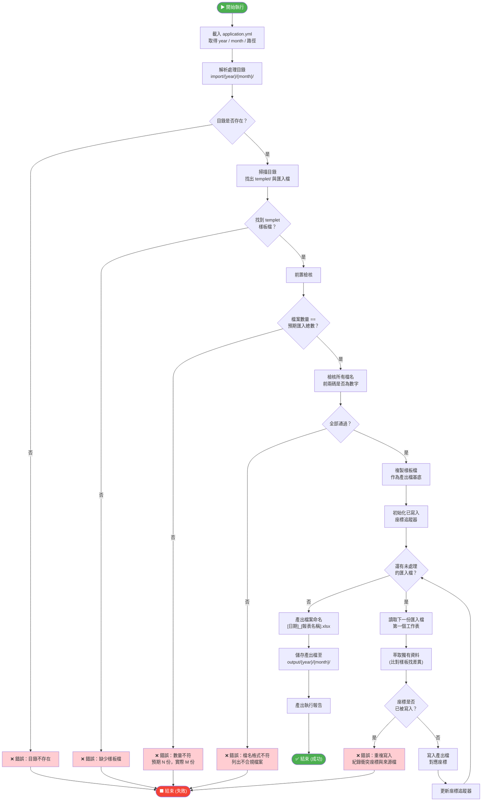
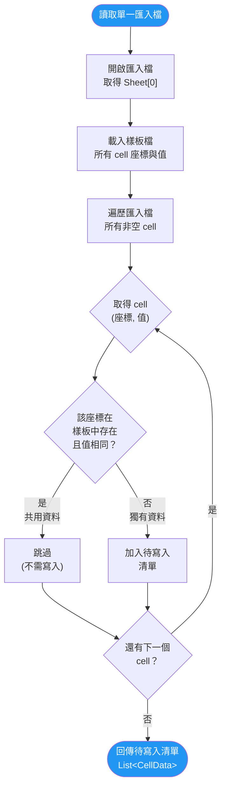
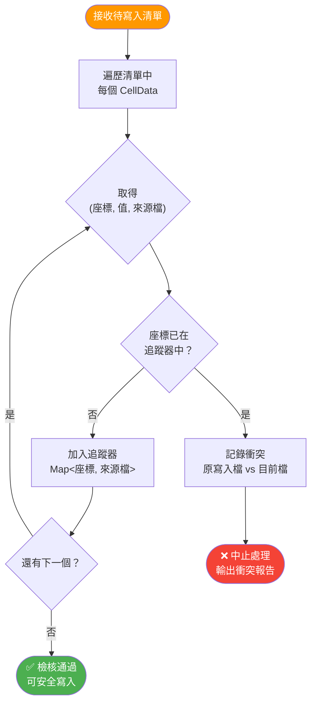
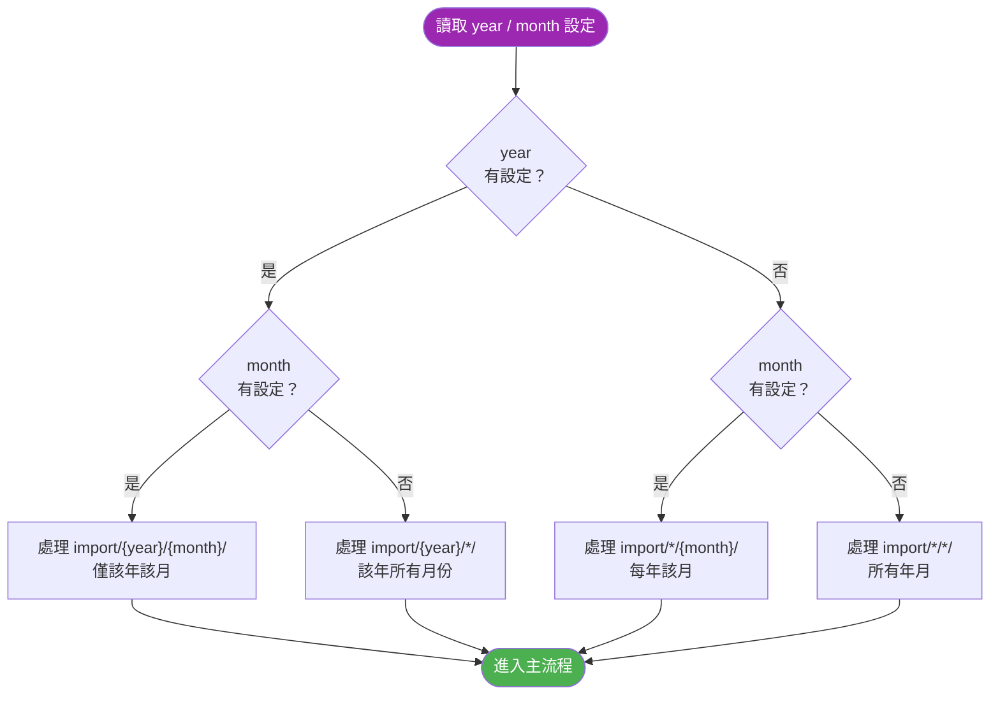
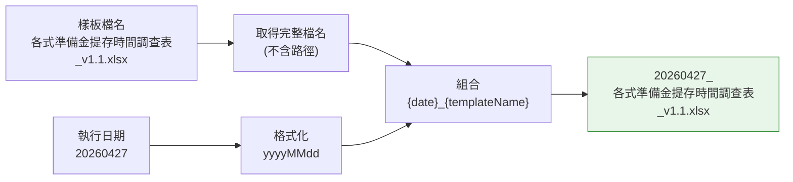
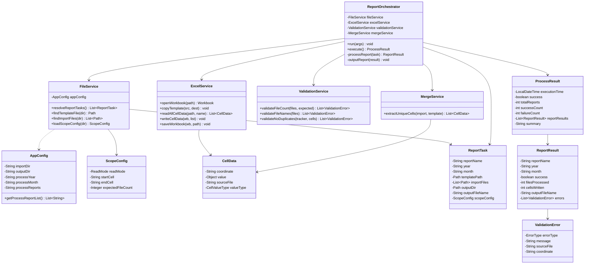
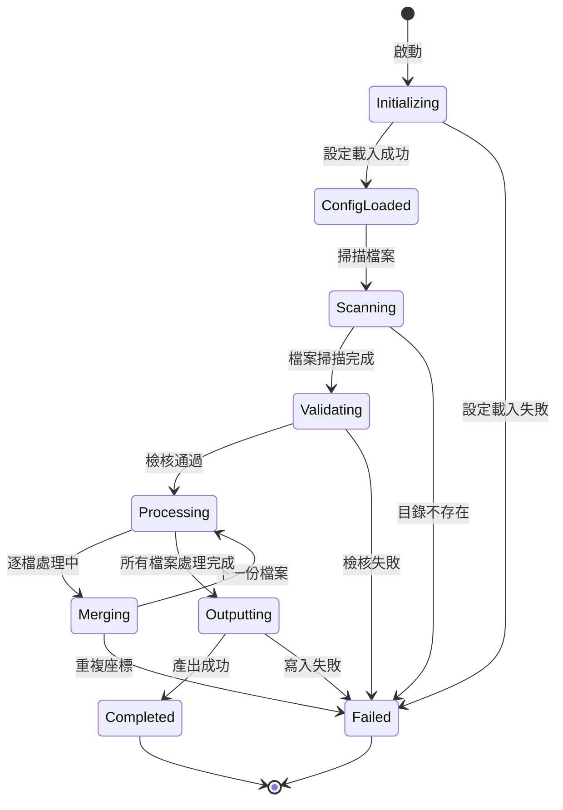

# 邏輯設計圖

> 專案：Excel Report Integration Engine  
> 版本：v1.0  

---

## 一、主流程 — 報表合併邏輯

---

## 二、資料萃取與比對邏輯

---

## 三、重複座標檢核邏輯

---

## 四、年月篩選邏輯

---

## 五、產出檔命名邏輯

---

## 六、Class 關係圖

---

## 七、狀態機 — 單次執行生命週期

