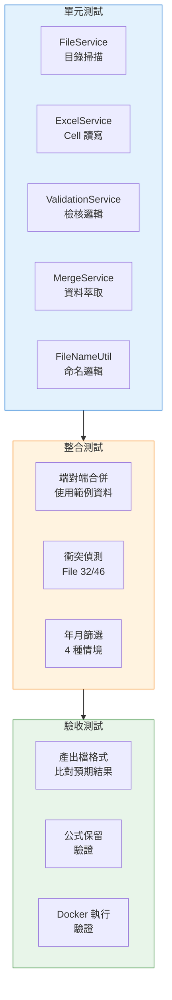

# 開發流程與階段規劃

> 專案：Excel Report Integration Engine  
> 版本：v1.0  

---

## 一、開發流程總覽

```mermaid
gantt
    title 開發階段規劃
    dateFormat X
    axisFormat Phase %s

    section Phase 1 - 專案初始化
    Maven 專案建立         :p1a, 0, 1
    Spring Boot 設定       :p1b, 1, 2
    YAML 配置設計          :p1c, 2, 3

    section Phase 2 - 核心模型
    Domain Model 建立      :p2a, 3, 4
    Exception 定義         :p2b, 4, 5

    section Phase 3 - 檔案處理
    FileService 實作       :p3a, 5, 6
    目錄掃描與年月篩選     :p3b, 6, 7

    section Phase 4 - Excel 處理
    ExcelService 實作      :p4a, 7, 8
    樣板複製與 Cell 讀寫    :p4b, 8, 9

    section Phase 5 - 檢核機制
    ValidationService 實作 :p5a, 9, 10
    檔案數量/名稱/重複檢核  :p5b, 10, 11

    section Phase 6 - 合併引擎
    MergeService 實作      :p6a, 11, 12
    資料萃取與比對          :p6b, 12, 13

    section Phase 7 - 流程整合
    ReportOrchestrator     :p7a, 13, 14
    端對端整合測試          :p7b, 14, 15

    section Phase 8 - 部署與文件
    Dockerfile 建立        :p8a, 15, 16
    README 與使用文件       :p8b, 16, 17
```



---

## 二、各階段詳細規劃

### Phase 1：專案初始化

**目標**：建立可運行的 Spring Boot 空專案

| 工作項目 | 說明 |
|---------|------|
| Maven pom.xml | Java 17, Spring Boot 3.4.x, Apache POI, Lombok, JUnit 5 |
| application.yml | 設計完整的 YAML 配置結構 |
| 目錄結構建立 | 依照架構圖建立 Java package 結構 |
| .gitignore | 排除 target/, IDE 設定, 暫存檔 |

**Commit**: `feat: initialize Spring Boot project with Maven`

---

### Phase 2：核心模型 (Domain Model)

**目標**：定義所有資料模型與例外類別

| 類別 | 說明 |
|------|------|
| `CellData` | 座標 (coordinate) + 值 (value) + 來源檔 (sourceFile) |
| `ReportTask` | 樣板路徑 + 匯入檔清單 + 輸出路徑 + 輸出檔名 |
| `ProcessResult` | 成功/失敗 + 處理數 + 寫入數 + 錯誤清單 |
| `ValidationError` | 錯誤類型 + 訊息 + 來源檔 + 座標 |
| `DuplicateCellException` | 重複寫入座標時拋出 |
| `FileValidationException` | 檔案檢核失敗時拋出 |

**Commit**: `feat: add domain models and exception classes`

---

### Phase 3：檔案處理 (FileService)

**目標**：實作檔案掃描、篩選、路徑解析

| 功能 | 說明 |
|------|------|
| `scanDirectory()` | 掃描指定目錄，列出所有 .xlsx 檔案 |
| `findTemplate()` | 在 templet/ 子目錄中找到樣板檔 |
| `findImportFiles()` | 過濾出前兩碼為數字的匯入檔 |
| `resolveProcessDirs()` | 根據 year/month 設定解析處理目錄 (4 種情境) |
| `resolveOutputPath()` | 建構輸出路徑 output/{year}/{month}/ |

**Commit**: `feat: implement FileService with directory scanning`

---

### Phase 4：Excel 處理 (ExcelService)

**目標**：封裝 Apache POI 的 Excel 讀寫操作

| 功能 | 說明 |
|------|------|
| `readWorkbook()` | 載入 Excel 檔案 (保留公式) |
| `readCellData()` | 讀取指定工作表所有非空 cell |
| `copyWorkbook()` | 完整複製樣板檔 (含所有工作表、格式、公式) |
| `writeCellData()` | 將 CellData 清單寫入指定工作表 |
| `saveWorkbook()` | 儲存 Excel 檔案 |

**關鍵注意事項**：
- 使用 `XSSFWorkbook` (非 data_only 模式) 以保留公式
- 複製時需保留：合併儲存格、欄寬列高、字型、框線、對齊、填色
- 寫入時僅寫值，不改變格式

**Commit**: `feat: implement ExcelService with POI integration`

---

### Phase 5：檢核機制 (ValidationService)

**目標**：實作所有驗證規則

| 檢核 | 說明 |
|------|------|
| `validateFileCount()` | 實際檔案數 == 預期匯入總數 |
| `validateFileNames()` | 所有匯入檔前兩碼為 00-99 |
| `validateNoDuplicates()` | 跨檔案座標不重複 |

**測試案例**：
- ✅ 正常: 20 檔 == 預期 20
- ❌ 少一份: 19 檔 != 預期 20
- ❌ 多一份: 21 檔 != 預期 20
- ❌ 檔名格式錯: `AB_XXX.xlsx`
- ❌ 重複座標: File 32 & 46 → B22 衝突

**Commit**: `feat: implement ValidationService with all checks`

---

### Phase 6：合併引擎 (MergeService)

**目標**：實作資料萃取與合併核心邏輯

| 功能 | 說明 |
|------|------|
| `extractUniqueCells()` | 比對匯入檔與樣板，找出獨有 cell |
| `mergeIntoOutput()` | 將萃取資料寫入產出檔 |
| `generateOutputName()` | 產出檔名 = `[yyyyMMdd]_[templetName]` |

**Commit**: `feat: implement MergeService for data extraction and merge`

---

### Phase 7：流程整合 (ReportOrchestrator)

**目標**：串接所有元件，實作完整的端對端處理流程

| 功能 | 說明 |
|------|------|
| `execute()` | 主入口，協調全流程 |
| 日誌輸出 | 每步驟記錄 INFO/WARN/ERROR |
| 執行報告 | 輸出 JSON 格式處理結果 |
| 整合測試 | 使用範例資料進行端對端測試 |

**測試案例**：
- ✅ 正常合併 (排除衝突檔案後的正常情境)
- ❌ 偵測 File 32/46 重複
- ✅ 年月篩選各情境
- ✅ 產出檔格式驗證 (公式保留、格式正確)

**Commit**: `feat: implement ReportOrchestrator and integration tests`

---

### Phase 8：部署與文件

**目標**：完成部署配置與使用文件

| 工作項目 | 說明 |
|---------|------|
| Dockerfile | 多階段建構, JRE 17 slim |
| docker-compose.yml | 目錄映射, 環境變數 |
| README.md | 專案說明、快速開始、配置說明 |
| CHANGELOG.md | 版本變更紀錄 |

**Commit**: `feat: add Docker support and documentation`

---

## 三、Git 分支策略

```mermaid
gitgraph
    commit id: "init"
    branch develop
    checkout develop
    commit id: "phase1-init"
    commit id: "phase2-model"
    commit id: "phase3-file"
    commit id: "phase4-excel"
    commit id: "phase5-valid"
    commit id: "phase6-merge"
    commit id: "phase7-orch"
    commit id: "phase8-deploy"
    checkout main
    merge develop id: "v1.0.0"
```

---

## 四、YAML 配置設計 (建議)

```yaml
app:
  # 基本目錄設定
  import-dir: ./import
  output-dir: ./output

  # 處理範圍 (可選)
  process-year: 115          # 民國年，留空 = 全部
  process-month: 01          # 月份，留空 = 全部

  # 報表設定
  reports:
    - name: 各式準備金提存時間調查表  # 報表識別名
      expected-file-count: 20         # 預期匯入總數
      read-mode: auto-detect          # auto-detect | area | horizontal | vertical
      # 以下為 area/horizontal/vertical 模式的可選設定
      # start-cell: B3
      # end-cell: H22

logging:
  level:
    com.example.engine: INFO
  file:
    name: ./logs/engine.log
```

---

## 五、測試策略


